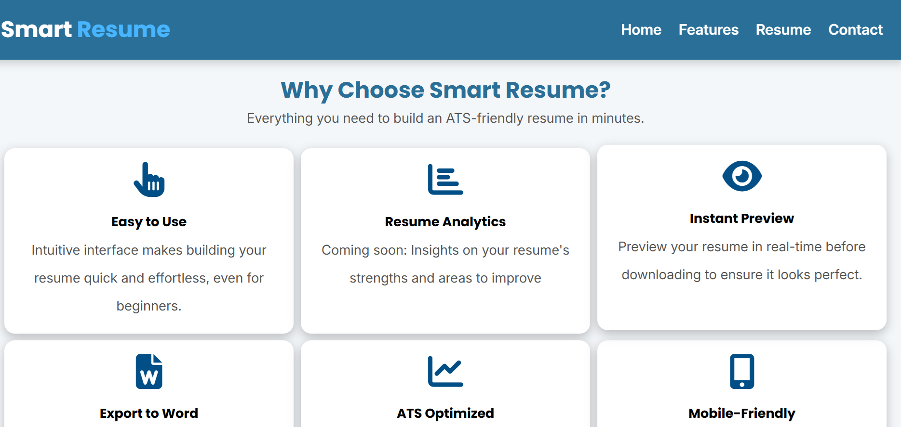
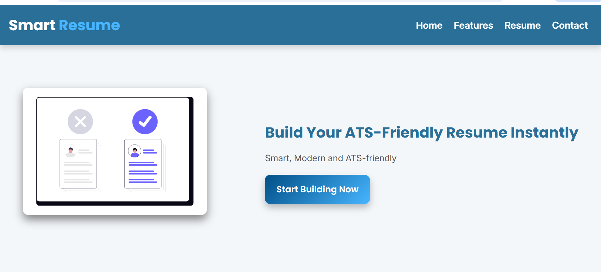
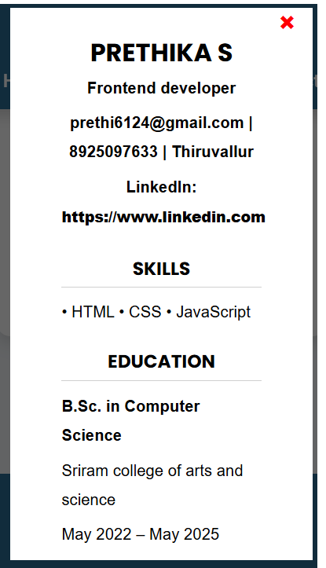

# Dynamic Resume Builder

A simple, interactive web app that allows users to dynamically add multiple entries for Education, Experience, and Projects. Users can preview their resume in real-time and export it as a Word document.

---

## Features

* Add multiple Education, Experience, and Project entries dynamically with cloning functionality.
* Unique IDs for each cloned input element to maintain form integrity.
* Clear and reset input fields when cloning.
* Preview resume in a clean, formatted layout before exporting.
* Export resume as a Word document (.doc) with embedded styling.
* Basic HTML5 validation before previewing.
* Responsive and user-friendly interface.

---

## Demo

[Live Demo](https://prethika06.github.io/smart-resume-builder/)

---

## Installation & Usage

1. Clone or download this repository.
2. Open the `index.html` file in your preferred browser.
3. Fill in your personal details.
4. Add Education, Experience, and Project entries using the **Add** buttons.
5. Click **Preview** to see your resume.
6. Export your resume as a Word document by clicking the **Export to Word** button.

---

## Usage Instructions

* **Adding entries:** Click the "Add" button on any section to add a new card.
* **Removing entries:** Use the "Remove" button on each card to delete it.
* **Preview:** Click the Preview button to see a formatted view of your resume.
* **Export:** Download your resume as a Word document for easy sharing.

---

## Folder Structure

* `index.html`       → Main web page
* `style.css`        → All your CSS
* `script.js`        → All JavaScript (cloning, preview, Word export)
* `README.md`        → Documentation for GitHub
* `screenshots/`     → Images for README demo

  * features-desktopview.png
  * homepage-desktopview.png
  * preview-mobileview.png
* `images/`          → Static files like favicon and resume PNG

  * favicon.jpeg
  * resume.png

---

## Technologies Used

* Vanilla JavaScript for dynamic DOM manipulation and event handling.
* HTML5 & CSS3 for layout and styling.
* Blob API to generate downloadable Word document files.

---

## Code Highlights

* Dynamic cloning of form sections with unique IDs.
* Clean preview generation from user input.
* Word export functionality with embedded CSS styling.
* Date formatting helper for consistent display.

---

## Future Improvements

* Use a date picker component for better date input UX.
* Enhanced form validation and error handling.
* Improved accessibility and keyboard navigation.
* Add support for more resume sections (certifications, awards).
* Save and load resume data locally or via backend.

---

## Screenshots

### Features (Desktop View)

### Homepage (Desktop View)

### Resume Preview Modal (Mobile View)

---
